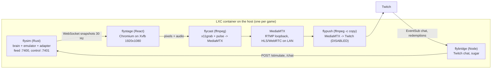
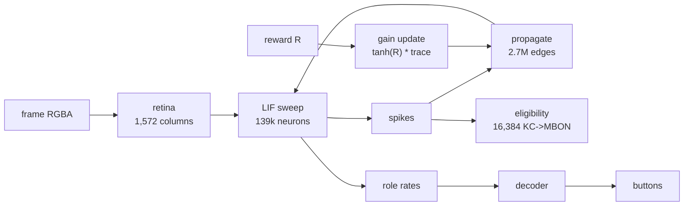
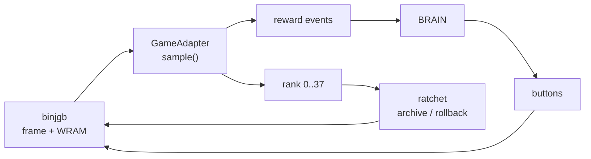
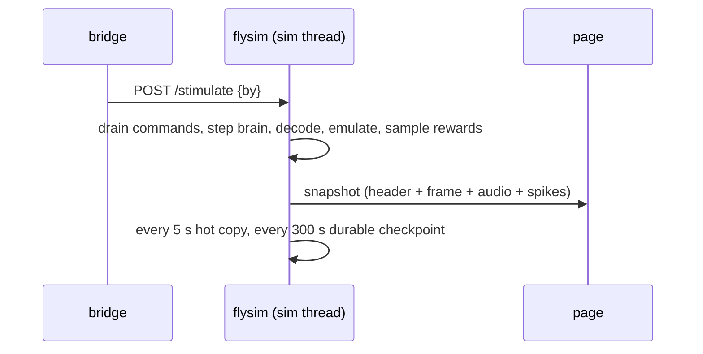
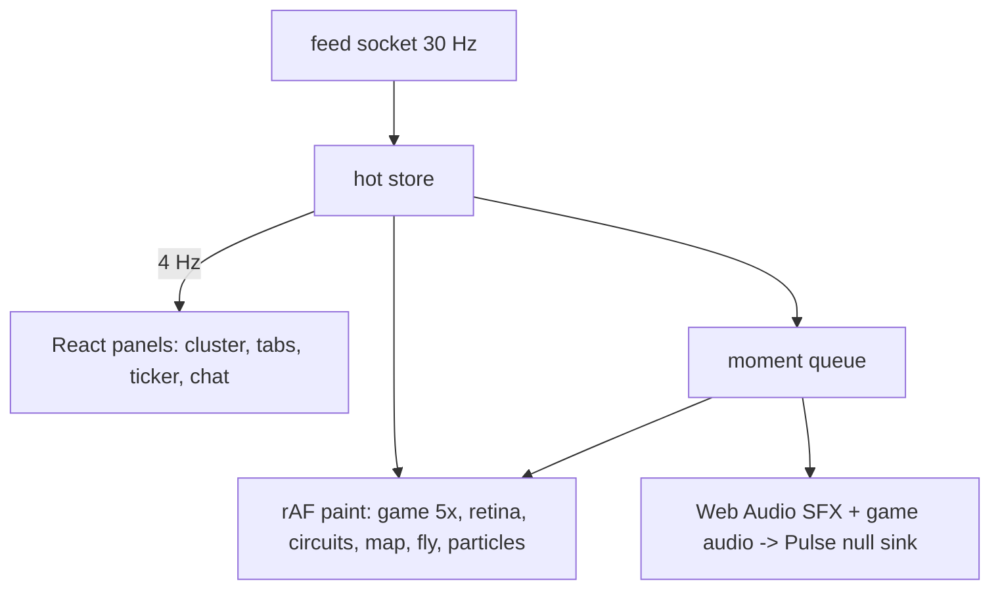
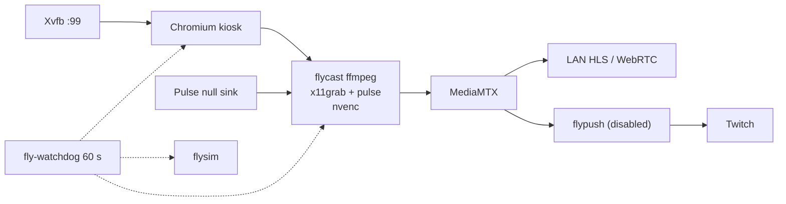

# flybrain architecture tour

Written 2026-09-16 for the operator, updated the same day after the walkthrough. Read top to bottom once; each layer says what it is, why it is that
way, and where the code lives. Binding contracts are `docs/feed-protocol.md` and
`docs/control-api.md`; decisions are logged in `docs/stream-mvp-plan.md`; designs in `docs/design/`.

## 0. One picture



The fly is one process. The page only draws. Chat can only feed the fly sugar. Nothing outside
`flysim` can press a button.

## 1. Neural core

**What.** A leaky integrate-and-fire network over the FlyWire FAFB v783 connectome: 139,255 neurons,
2,700,513 signed edges in CSR form, stepped once per simulated millisecond. Anatomical roles
(Kenyon cells, MBONs, PAM dopamine neurons, descending "command" neurons bucketed eight ways, the
L1 retina columns) are labels from the dataset, not inferred functions.

- Retina: the 160x144 frame is projected onto 1,572 L1 columns by luminance (`model/retina.ts`).
- Kernel: Float32 membrane, 20 ms decay, threshold 1, 2 ms refractory, 300 random noise kicks per
  ms, deterministic xorshift RNG, rate EMAs per tracked role (`model/lif.ts`).
- Learning: three-factor reward-modulated STDP on the 16,384 strongest excitatory KC to MBON
  synapses only. Eligibility from spike pairing (+0.1 causal, -0.05 anti-causal, 20 ms constant,
  5 s decay); on a reward R, gain += 0.002 tanh(R) trace, clamped to [0.9, 1.1]. The measured
  weights never change; a gain multiplies them (`model/plasticity.ts`, `docs/plasticity.md`).
- Readout: `PopulationDecoder` turns role rates into channels: an exclusive direction group with
  800 ms holds, hysteresis 1.05, fatigue and a blocked-direction cooldown (all measured,
  `infra/docs/room-escape.md`), plus pulse channels for A/B and a throttled Start/Select. Fixed,
  never learned; its one input that is not a rate is the name of a direction the sim loop has
  watched produce no movement, which raises that channel's habituation and nothing else
  (`readout/decoder.ts`, `presets/gameboy.ts`, `presets/platformer.ts`, `docs/readout.md`).
- Agent loop: 2,500 ms warm-up with plasticity off, calibrate the decoder on resting rates, then
  per frame accumulate 1000/59.7275 ms, step 16 or 17 ticks, decode, set the frame, stimulate,
  reinforce (`agent/agent.ts`).

**Why.** Extracted from the `fly-plays-pokemon` prototype so several games share one core. The
TypeScript in `packages/brain` is the reference: verbatim copies of the prototype modules live in
`packages/brain/tests/legacy/` and every generalized module has a bit-exact oracle test against
them, including a run on the real dataset. Version strings `lif-1ms-f64-v2` and
`fly-kc-mbon-rstdp-v2` are pinned so checkpoints stay compatible.

**Rust port.** `services/flysim/crates/flybrain-core` is the same kernel, bit-exact at 0 ulp with
the TypeScript (golden files under `services/flysim/golden/`, generated by
`packages/brain/tools/golden.ts`). Getting there needed the `libm` crate for `exp` and a
transcription of fdlibm's `tanh`; glibc differs from V8 by 1 ulp. Threading: the neuron sweep is
sharded by index range, spike propagation is sharded by target range and plasticity's `observe` by
slot range, so per-target addition order and per-slot trace order are both preserved, plastic edges
are found through a ranked bitset instead of a 2.7M-entry slot array, and a persistent worker pool
replaces rayon's per-tick joins. Results are identical for any thread count. Measured: 3.4x real
time at 6 threads on the laptop, 1.75x at 3 threads on the host's Haswell, and 3.6x against 3.1x at
four whole cores once `observe` was sharded too (`infra/docs/simloop-profile.md`).



Where: `packages/brain/src/{model,readout,agent,dataset}`, `docs/{model,plasticity,readout}.md`,
`services/flysim/crates/flybrain-core/src/{lif,plasticity,decoder,agent,pool,bitset}.rs`.

## 2. Game layer

**What.** `flybrain-gb` wraps the binjgb emulator natively (vendored C at revision c60e138 with a
small shim; no WASM) and defines a `GameAdapter` trait: sample game memory once per frame, emit
reward events, report a mode, a progress rank, whether the state is safe to snapshot, and the
decoder preset to use.

- Pokémon Red adapter (`pokemon_red/`): reads audited WRAM addresses generated from the pret/pokered
  disassembly at commit 0cd19d3 (`symbols.rs`), gates rewards on a playable state, baselines already
  achieved flags on the first sample so a restore never replays them, and pays only positive
  rewards: story flags, exploration coverage (capped per map), new areas, Pokédex entries, trainer
  flags, decaying wild wins, badges. Version `pokered-unique8-v5`.
- Ratchet (`ratchet.rs`): a 38-rung ladder (boot, bedroom, Pallet Town, Oak's lab, starter, parcel,
  Pokédex, each town, each badge, the Elite Four, Champion). On first reaching a higher rung in a
  safe state it archives the emulator snapshot; on a stall (120 s without new exploration) or a game
  over it rolls the game back to the best snapshot. Only the game rolls back: the brain keeps its
  clock, RNG and learned gains; decoder holds and eligibility traces are cleared. Rank is the max
  over satisfied conditions and reads flags from a lifetime ledger, because the game itself clears
  the Elite Four flags after a blackout (`docs/design/ladder.md`).
- Platformer adapter (`platformer/`, Super Mario Land, `sml-progress-v1`): progress from the level
  loader's screen and column indices in HRAM, band rewards for new ground, coins, score, power-ups,
  level and world clears; 16 rungs; its own recovery policy (game over restores immediately). Several
  addresses are marked UNVERIFIED until a ROM is on hand (`docs/design/platformer.md`).
- Compatibility string: kernel version / adapter version / dataset fingerprint / plasticity version /
  binjgb revision / disassembly commit / emulator state size. A checkpoint restores only on an
  exact match.

**Why.** All rewards positive and all learning inside the brain is doctrine: the fly is really
playing, and the readout is fixed. The ratchet exists because a random-ish walker cannot make
net progress over days without one. The trait exists because the second demo shares the binary
(`FLY_GAME=pokemon-red|platformer`).



Where: `services/flysim/crates/flybrain-gb/src/{emulator,adapter,ratchet,recovery,compatibility}.rs`,
`pokemon_red/`, `platformer/`, `services/flysim/vendor/binjgb/`, `services/flysim/tools/gen_symbols.py`.

## 3. flysim service

**What.** The one process that owns the fly. Per frame, on a single sim thread: drain control
commands, step the brain 16 or 17 ms, decode, apply buttons, run one emulator frame, set the
retina, sample rewards, stimulate PAM, reinforce, let the ratchet observe (and maybe roll back),
publish. Pacing uses absolute deadlines at 1.0x by default; it never skips frames, it reports lag.

- Feed (`docs/feed-protocol.md`): WebSocket `ws://127.0.0.1:7400/feed`, one binary message per
  snapshot at 30 Hz: a JSON header (status, rates, learning stats, game mode, milestone rank and
  total, sugar state, events, chat ring) followed by attachments: RGBA frame, f32 stereo 48 kHz
  audio (binjgb's unipolar u8 converted and DC-blocked), and a 17,407-byte spike bitset.
- Control API (`docs/control-api.md`): loopback HTTP :7401. `POST /stimulate` (sugar: a timed PAM
  pulse, rate-limited server side), `POST /reward` (present, disabled by config), `POST /chat`
  (sanitized, deny-listed, ring of 12), `/status`, `/checkpoint`, `/pause`, `/resume`,
  `/healthz`, `/metrics`. There is no button endpoint; a test asserts the route table has none.
- Checkpoints: the prototype's envelope format (magic, JSON manifest, named chunks, CRC32 footer)
  written atomically. A hot copy every 5 s to tmpfs, a durable copy every 300 s to disk (SSD
  endurance), plus one per rung archive. The sim thread only clones the state — the consistent
  snapshot; the envelope encoding and the writes happen on the checkpoint writer thread, because
  encoding on the sim thread cost 11.5 ms in whichever frame carried the hot copy. Restore order: latest, previous, archives. If every
  candidate fails the service exits non-zero; it never silently starts fresh.
- Event log: JSONL per day, the source for the ticker and the recap tooling.

**Why the demo bricked once.** Deploying the 38-rung ladder changed the adapter version, so the
new binary refused the container's v3 checkpoints and exited by design; systemd parked it. The fix
is a deploy-time compatibility check that refuses to flip the release unless the operator opts into
archiving the state (`FLY_RESET_STATE=1`).



Where: `services/flysim/crates/flysim/src/{main,config,simloop,pacing,snapshot,feed,api,chat,store,eventlog,metrics}.rs`,
`docs/design/flysim.md`.

## 4. Stage page

**What.** `apps/stage`, React 19 plus Vite plus shadcn, authored at 1920x1080 and shown in a
kiosk Chromium on Xvfb. Left column: title strip, the game at exactly 5x (800x720), a fly strip
with the eight button chips along its top and, under them, the fly on the left with the macro
cells beside it -- one per macro the scene binds, in a fixed order by type, each showing its own
channel's tag (`docs/design/macros.md` sections 6 and 12; a MODE chip by the version chip says RAW
or MACROS). Right rail (layout v2): a progress cluster (rung name
and next rung, the 38-cell spine, badges and places, HERE FOR with tries, BRAIN Hz, clock and day,
SUGAR READY chip), a tab slot cycling SENSES (retina plus circuit bars), CONNECTOME (2D density
map of recent spikes over a prerendered base) and LADDER (full ladder, best snapshot, rollback
budget, stall meter), an EVENTS ticker, and a persistent CHAT panel.

- Motion (`src/motion/`): every number lerps, tabs crossfade, a priority queue of "moments"
  (badge, milestone, rollback, sugar, small reward, day rollover, mode change) drives caption
  bands, spine pulses, a particle layer (max 400, additive) and tiered synthesized SFX. Catalogue in
  `docs/design/animation.md`.
- Fly avatar (`src/fly/`): a procedural low-poly Drosophila in three.js, with a hand-projected 2D
  "paper" fallback when WebGL is unavailable (the CPU kiosk runs `--disable-gpu`). Legs walk from the
  forward and backward descending neurons, stride and yaw from the steering neurons, wings from the
  descending command drive (a `motor` role in the feed is the honest source, not yet added),
  proboscis from the proboscis neurons and sugar, head glow from the PAM rate. It does not press
  buttons; the chips are the decoder's.
- Feed layer: a hot mutable store read by the paint loop at 60 Hz, a cold React store committed
  at 4 Hz. `?mode=player&fixture=steady` replays a recorded `.flyfeed`; `?mode=live` connects to
  the service.
- Gates and tests: Playwright screenshot baselines per fixture and tab, a text-size lint (body 27
  px and up at 1080), a legibility check at the 0.31 phone downscale, structural checks (one tab
  visible, one GL context for the fly, no scrollbars). Mockups under `apps/stage/mockups/` are the
  sign-off medium; the operator reacts to pictures.

**Why.** The page is display only so the fly survives browser and encoder restarts. Layout B from
the stream research (game dominant, rail of legible state) with the research's lesson that visible
long-horizon progress and visible failure retain viewers.



Where: `apps/stage/src/{App.tsx,lib/geometry.ts,panels,panels/tabs,motion,fly,paint,feed,audio,games}`,
`apps/stage/README.md`, `docs/design/{stage-bridge,fly-avatar,animation,gameboy-theme}.md`.

## 5. Bridge

**What.** `services/bridge`, Node plus twurple. EventSub WebSocket for chat (messages arrive after
Twitch AutoMod), template-only replies (`send()` accepts a template id, never a string), commands
`!fly !brain !how !stuck !sugar` with per-user and global rate limits, an explainer poster every 20
minutes when chat is active, Channel Points "Sugar" redemptions (create the reward, fulfil on a
202 from the sim, refund on failure, replay pending intents on restart), and on-screen chat
forwarding through `validateDisplayName` and `sanitizeChatText` to `POST /chat`. Predictions are
behind a flag (Affiliate only).

**Why.** Nothing, Forever got banned for generated text; every outbound string here is a constant.
Names are validated at one chokepoint in `packages/feed/src/names.ts` and text at
`packages/feed/src/chat.ts`, with a shared hostile-input fixture that the Rust sanitizer must also
pass. The page never talks to Twitch.

```mermaid
flowchart LR
  TW["Twitch EventSub"] -->|chat, redemptions| BR["bridge"]
  BR -->|template reply| TW
  BR -->|/stimulate, /chat (validated)| SIM["flysim"] -->|events, chat ring| PAGE["page"]
```

Where: `services/bridge/src/{index,config,auth,scopes,eventsub,chat,commands,templates,ratelimit,sim,redemptions,onscreen-chat,explainer,health}.ts`,
`packages/feed/src/{names,chat}.ts`.

## 6. Infra

**What.** One unprivileged Debian 13 LXC per demo on the host (nesting on for Chromium's sandbox), 8
cores, 8 GB, root and state on the SSD pool, recordings on the raidz2 array with a quota. A
`fly.target` of units: `xvfb` (1920x1080x24), `pulse` (null sink at 48 kHz, never suspends),
`mediamtx` (RTMP loopback, HLS and WebRTC on the LAN), `flysim` (Type=notify, watchdog 30 s),
`flystage-web` (static server) and `flystage` (kiosk Chromium), `flycast` (ffmpeg encodes once and
tees to MediaMTX plus 10-minute TS segments), `flypush` (copy-only remux to Twitch, disabled),
`flybridge`, timers for a 23 h push restart (48 h Twitch cap), retention, daily recap, nightly
backup to the backup host, and a 60 s watchdog that restarts only the failed unit. Secrets come from
`pass` on the WSL box into systemd credentials; never in the repo or the journal.

- GPU: the Quadro RTX 4000 is passed through by device nodes (majors rewritten at boot by
  `fly-nvidia-majors.service`, since the uvm major is dynamic), the matching 580.76.05 userspace is
  installed in the container, and `flycast-launch` uses `h264_nvenc` with an automatic x264
  fallback. Chromium stays on the CPU on the release containers. Why GPU-in-the-browser is hard:
  NVIDIA GL needs a real NVIDIA X server, and we capture from Xvfb; an in-container NVIDIA Xorg
  needs the host console (`/dev/tty0`); headless Chromium with GPU forces the CPU screencast
  capture path. The one clean option is VirtualGL's EGL back end (render on the card, blit into
  Xvfb, x11grab unchanged) — **spiked 2026-09-16 and it passes**, shipped as
  `CHROMIUM_PROFILE=vgl` and running on the dev container: hardware WebGL from the Quadro, the 3D
  fly at 35-37 fps, and total Chromium CPU 1.06 core against 1.38 on the paper fly. The GPU turns
  out to pay for the page's 2D canvas raster, not for the fly. Two catches: it needs
  `--disable-gpu-sandbox` (VirtualGL opens its own X connection inside the GPU process), and it is
  unsoaked on a card shared with the GPU workload in the neighbouring container, so the release containers still run the paper
  fly. `infra/docs/virtualgl-spike.md`.
- CPU pinning finding: PVE's default cpuset gave 6 physical cores as 8 vCPUs across both sockets;
  the brain wants whole physical cores, so containers get an explicit cpuset and 3 threads.
- Provisioning is shell (`provision.sh` and numbered steps), idempotent, with `verify.sh` and a
  lint suite that runs shellcheck and `systemd-analyze verify`. Two spikes on the host found and fixed
  about seventeen bugs before any container was called production.



Where: `infra/{provision.sh,0*-*.sh,verify.sh,units,bin,config,env,host,docs/runbook.md,docs/p0-measurements.md}`,
`docs/design/{infra,gpu}.md`, `docs/streaming-plan.md`.

## 7. Decisions, with the reason

- Browser is display only; the sim is a service: survives restarts, no tab throttling, testable
  headless, bridge talks to the sim directly.
- Rust for the service: Node reached 0.92x real time on a fast laptop and the host's cores are about
  half that; the kernel is bandwidth-bound and needed real threads.
- Sugar only for viewer influence: the fly really plays; sugar is the PAM stimulation the model
  already has, transient, rate-limited, logged on screen. A "who trains the fly" slider is parked.
- Game audio from the emulator: what every precedent stream does; VOD mutes are the only risk.
- Native 1080p with the game at 5x: needed room for the fly under the screen; encoder cost is small.
- Two channels: one stream key admits one encoder. Channel Points need no Affiliate any more.
- No going live without the operator's explicit approval per run. `flypush` stays disabled.
- Never edit `packages/brain` semantics to match another implementation; change the other side.

## 8. How to run it here

```bash
npm ci && npm test && npm run typecheck            # 477 TS tests
cd services/flysim && cargo test --workspace       # 300 Rust tests; set FLY_ROM for the ROM-gated ones
npx tsx packages/feed/src/fake/server.ts --scenario running   # fake flysim on :7400/:7401
cd apps/stage && npm run dev                       # then open ?mode=player&fixture=steady
#   ?mode=live connects to a real or fake flysim; ?tab=senses|connectome|ladder; ?fly=webgl|paper|off; ?theme=t1
cd apps/stage && npm run test:e2e && npm run mockups          # Playwright suite and the review PNGs
cargo run --release -p flysim -- --config flysim.toml         # real service: needs the ROM path and data/fafb-v783
bash infra/tests/lint.sh                           # infra scripts and units
```

The Pokémon ROM lives only at `~/fly-plays-pokemon/` and inside the demo container; it is never in
the repo.

## 9. Open items and limits

- Demo container the dev container on the host is temporary; the production containers the release container/151 are not built.
- Twitch: broadcaster account and stream key exist; dev app, bot account, bridge authorization and
  the Sugar reward are not done. Nothing has ever gone live.
- Game Boy theme pass on the page in progress; the font pick is the operator's.
- VirtualGL EGL spike: **done, passed**, running on the dev container as `CHROMIUM_PROFILE=vgl`. Owed before
  it could go anywhere near a release box: a 1-4 h soak, and a the GPU workload in the neighbouring container job on the neighbouring GPU container while the kiosk
  holds a GL context. `--disable-gpu-sandbox` is required and is the operator's call for a public stream.
- Platformer: needs a Super Mario Land ROM hash and a watchpoint pass over the UNVERIFIED addresses.
- A/V drift over an hour and the constant vs variable frame rate question are unmeasured.
- The feed lacks a `motor` role rate; the fly's wings run off descending command drive meanwhile.
- The FlyWire credit (CC BY-NC) has no on-screen home since the explainer card was removed; it must
  appear in the channel About panel at minimum.
- Stage fixtures are 6 to 10 MB binaries in git; decide on LFS before pushing to the operator's git remote.
- Science claims: synthetic reward modulator, retina is not fly optics, learning not shown to
  improve play. `docs/limitations.md` is the honest list.
